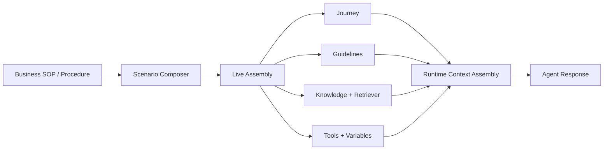
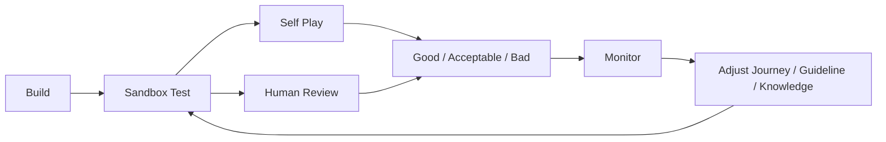
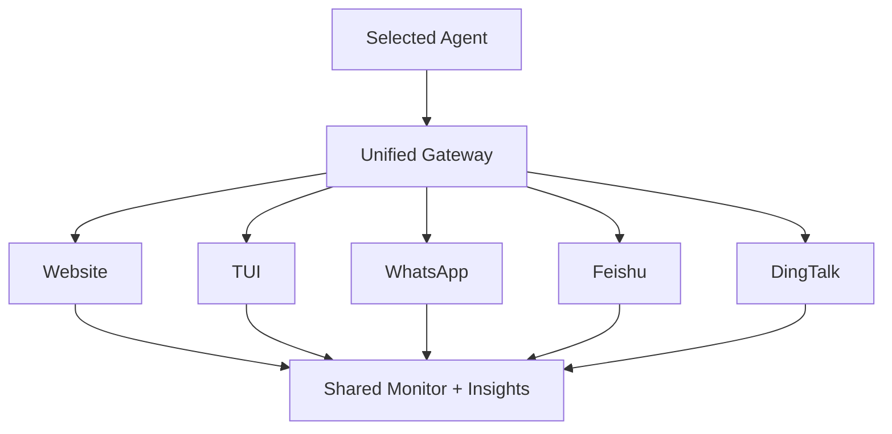
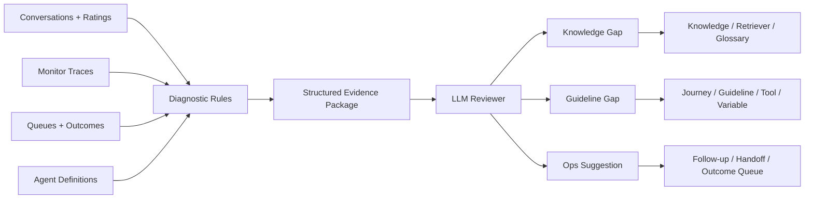

## 用 Agent Studio + Insights 构建可调优、可部署、可进化的 Agent 系统

这篇文档不是功能说明书，而是一篇产品构建随想录。它记录的是一个判断：如果我们继续把 Agent 当成一段 prompt、一个聊天框、一次模型调用，那么它很难真正进入复杂业务。真正进入业务之后，Agent 必须具备四种能力：

1. 能被构建，而不是只能被“写出来”。
2. 能被测试，而不是上线后再碰运气。
3. 能被监控，而不是只看最终回复。
4. 能被部署到多个渠道，并在部署后继续被优化。

QMorph 的目标，不是做一个 prompt playground，也不是做一个单一对话机器人，而是构建一个围绕 Agent 全生命周期运转的工作台：`Build -> Test -> Monitor -> Deploy -> Insights`。

在这个判断背后，有几条很强的产品启发：

- Parlant 提供了一套足够细、但仍然可组合的最小建模单元，让 Agent 能在运行时动态装配上下文，而不是把所有能力硬塞进一段超长 prompt。
- Fin 的产品思路说明，真正可落地的 AI Agent 产品，不只是回答问题，还必须具备 Guidance、Procedures、Preview、Analysis 和持续优化的闭环。
- Claude 的 Skills / memory 思路说明，复杂能力不是一次性塞给模型，而是应该拆成可复用、可组合、可按需加载的上下文资产。
- Harness 的工程化思路说明，Agent 一旦进入真实生产环境，就必须被治理、被观测、被验证，而不是停留在 demo 阶段。

QMorph 的核心问题因此非常明确：如何在**降低 Agent 构建门槛**的同时，**提高 Agent 实际效果**，并让这套系统可以被持续调优。

---

## 1. 为什么我们不再把 Agent 当成“一个 prompt”

一个 prompt 可以生成一句不错的回复，但很难稳定完成一个复杂业务任务。原因不是模型不够强，而是业务本身已经超出了“一次生成”的边界。

真实业务里，Agent 需要同时处理：

- 当前对话处于哪个流程阶段
- 当前客户表达了什么意图
- 哪些规则必须被遵守
- 哪些术语需要统一表达
- 哪些知识应该被动态查找
- 哪些系统动作可以执行
- 哪些信息应该记住
- 哪些内容必须升级给人类处理

如果这些东西都塞进一段长 prompt，就会出现三个问题：

1. 上下文混杂。流程、规则、知识、动作全部耦合在一起。
2. 调优困难。用户不知道到底应该修改哪一部分。
3. 运行不透明。出了问题，只能模糊地说“模型没答好”，却不知道是流程错了、知识缺了，还是规则没命中。

因此，QMorph 的第一原则是：**不要把 Agent 当作一个静态 prompt，而要把它当成一个由最小构件动态组装出来的系统。**

---

## 2. Agent Studio：降低构建门槛，同时提高 Agent 效果

### 2.1 用最小建模单元替代超长 prompt

QMorph 选择以 Parlant 提供的最小建模单元作为 Agent 的内部装配层：

- `Journey`
- `Guidelines`
- `Glossary`
- `Tools`
- `Retrievers`
- `Variables`
- `Canned Responses`

这套单元的价值，不在于“技术上更优雅”，而在于它们能把业务问题拆回到业务可理解的层级。

#### Journey
Journey 负责表达流程。它不是一个表单，也不是纯流程图，而是 Agent 当前“应该处在哪个业务阶段”的结构表达。对于保险外呼类场景，Journey 天然对应：

- Opening
- Current coverage
- Need discovery
- Intent outcome
- Follow-up / handoff

Journey 的作用是给 Agent 一个“当前位置”的概念。没有 Journey，Agent 很容易在多轮对话里失去节奏，要么重复同样的问题，要么在不该推销的时候开始解释产品。

#### Guidelines
Guidelines 负责行为约束。它们不是纯粹的 SOP 文案，而是运行时用来影响 Agent 判断的规则资产。

Guideline 可以表达：

- 如何开场
- 如何处理异议
- 什么时候不要强推
- 什么时候应该 handoff
- 如何维持特定语言和语气

在 QMorph 中，Guideline 的价值很大一部分来自**可调优性**。当一段对话效果不佳时，我们不用重写整个 Agent，而是能定位：是不是某条 Guideline 需要改。

#### Glossary
Glossary 解决的是术语一致性。业务系统里最常见的问题之一，是不同人、不同文档、不同语言在表达同一个概念时不一致。

Glossary 让 Agent 知道：

- 什么是 coverage gap
- 什么是 top-up
- 什么是 do not call
- 中文、英文、日文、德文、韩文分别怎么表达

它解决的不是知识深度，而是表达稳定性和概念对齐。

#### Tools
Tools 负责动作执行。Tool 的本质不是“让模型更聪明”，而是让 Agent 能够调用外部系统，执行确定性动作。

例如：

- 记录 lead outcome
- 创建 follow-up plan
- 生成 handoff packet

Tool 的存在，意味着 Agent 不只是说话，而是真正能进入业务流程。

#### Retrievers
Retriever 负责知识 grounding。它不执行动作，而是把应该知道的业务知识按需拉进当前回复。

例如，在保险场景里：

- 医疗险与重疾险区别
- 免赔额是什么
- 哪类客户更适合某种保障

Retriever 的价值在于：Agent 不需要把所有知识都背进 prompt，而是在合适的时候读取合适的知识片段。

#### Variables
Variables 负责状态和记忆。它让 Agent 在多轮对话中能够保留：

- lead 的语言偏好
- 已知保障情况
- 预算信号
- 当前 intent status

没有 Variables，多轮对话就只是多次独立生成，而不是一次连续业务过程。

#### Canned Responses
Canned Responses 负责稳定表达。它们不是为了替代模型，而是为了在关键位置保持稳定语气和品牌表达。

例如：

- respectful opening
- compliant close
- handoff bridge

这让 Agent 在某些关键场景下可以更稳定，而不是每次都自由发挥。

### 2.2 动态上下文组装，比静态 prompt 更适合真实业务

QMorph 的核心构建思想，不是写出一段最好的总 prompt，而是在运行时根据当前上下文**动态组装**：

- 当前 Journey state
- 当前适用的 Guidelines
- 当前需要的 Glossary
- 当前要用到的 Variables
- 当前是否要调用 Tool
- 当前是否要拉取 Retriever
- 当前是否适合使用某个 canned response

这套动态装配模型带来三类直接收益：

1. **精确性**：当前回复只拿当前真正相关的上下文。
2. **可维护性**：修改某个构件不需要重写整个 Agent。
3. **可解释性**：运行时可以看到“这条回复为什么会这样生成”。

这也是 QMorph 后续把 `Monitor` 做成 request-based debugger 的根本原因：如果系统是动态组装的，那么监控就必须能看到这次组装到底发生了什么。

### 2.3 为什么 Agent Studio 必须降低门槛

虽然内部用的是 Journey、Guideline、Retriever 这些构件，但普通运营人员并不应该一上来就面对这些概念。

对多数运营来说，他们真正拥有的是：

- 一段业务目标说明
- 一套 SOP
- 一些常见客户问题
- 一些不能违反的边界
- 一些必须调用的系统动作
- 一批需要补充的知识

因此，QMorph 的构建方向不是“让运营直接写 Guideline DSL”，而是：

1. 先让他们用业务语言写 `Scenario / SOP / Procedure`
2. 系统再自动拆成：
   - Journey
   - Guidelines
   - Glossary
   - Tools
   - Retrievers
   - Variables
   - Canned Responses
3. 再通过 `Live Assembly` 给高级用户做结构化修订

这背后的产品方法是：

- 低门槛入口：业务语言
- 高级控制层：结构化 Assembly

这件事目前还没有完全做完。**如何更好地降低门槛，提供更好的 Agent 构建方式，仍然是一个 TBD。**

### 2.4 Test：POC 阶段就必须证明 Agent 有效

很多 Agent 产品失败，不是因为模型太差，而是因为它们把测试放到了最后。先 build，再上线，再看结果。这在真实业务里代价太高。

QMorph 的判断是：**在实施和 POC 阶段，Agent 的效果就必须被验证到接近可用水平。**

因此，`Test` 不是一个附属工具，而是 Agent Studio 的核心组成。

它至少应该支持：

- 不同 Lead profile 的对话测试
- 多语言测试
- `Self Play` 自动模拟客户
- 人工评分：
  - Good
  - Acceptable
  - Bad

这几件事的组合价值非常高：

- 普通运营可以快速看到“这套 Agent 在实际客户面前会怎么表现”
- 自演练让测试从手工操作变成半自动仿真
- 评分让测试结果能进入后续离线分析

这和 Fin 的 Preview、Simulation 思路是相通的：**Agent 必须在上线前就能被演练，而不是只在生产环境里试错。**

### 2.5 Monitor：监控不是看日志，而是指导调优

传统软件监控关心的是：

- 请求是否成功
- 响应时间
- 错误码

但 Agent 系统如果只看这些，就远远不够。因为最关键的问题不是“它有没有返回”，而是：

- 这次命中了哪些 guideline
- 哪些规则被剪枝了
- 是否调用了 tool
- generation context 里到底包含了什么
- response analysis 做了什么判断

因此，QMorph 的 Monitor 必须能够观察四个核心阶段：

1. Guideline Matching
2. Tool Calling
3. Message Generation
4. Analysis / Runtime Review

这也是为什么 Monitor 需要用 request-based debugger 的形态，而不是只给一个 trace 列表。对 Agent 调优者来说，真正的问题是：

- 为什么这一轮回复慢？
- 为什么这一条规则没命中？
- 为什么 tool 没执行？
- 为什么生成用了这段 context？

只有看见这些细节，Monitor 才能真正指导调优，而不是只是观测系统健康。

这一点与 Harness 对工程治理和可观测性的强调是相通的：**一旦 Agent 进入生产级使用，它就必须可被观测、可被解释、可被诊断。**

### 2.6 Deploy：多渠道不应该意味着多个 Agent

很多团队在接入不同渠道时，会把 Website、WhatsApp、企业 IM 当成不同机器人来维护。这样做的短期路径看似简单，但长期问题很大：

- 配置重复
- 行为不一致
- 渠道之间无法共享优化成果
- 难以统一监控和 rollout

QMorph 的 Deploy 思路是：**一个 Agent，通过统一 Gateway 对外暴露给多个 Channel。**

这意味着：

- Website 是入口
- TUI 是内部测试入口
- WhatsApp 是外部消息入口
- Feishu / DingTalk 是企业协作入口

但这些不应该对应 5 个不同的 Agent，而应该是同一个 Agent 在不同 channel 上的部署形态。

这就是为什么 Deploy 要借鉴 OpenClaw 的思路：统一 gateway 控制多个 channel。  
对 QMorph 来说，Gateway 的职责包括：

- 标准化不同渠道的输入输出
- 创建 session
- 附加 channel metadata
- 控制 rollout
- 统一记录部署状态

这里真正还没有做完的是：**如何一键部署到多个渠道（TBD）**。当前 Deploy 更多还是前端结构和概念验证，还没有接入真实多渠道发布。

---

## 3. Insights：让对话成为资产，而不是一次性调试材料

如果 Build、Test、Monitor 解决的是“怎么把 Agent 做出来并调好”，那么 Insights 解决的是另一个问题：

**上线之后，怎样把大量对话变成持续优化的燃料。**

### 3.1 Conversations：首先要把对话持久化

如果对话只是一次 UI 里的临时过程，那一切离线优化都无从谈起。

QMorph 因此要求 Conversations 至少要持久化这些内容：

- transcript
- session metadata
- agent / lead 归属
- 是否是 self play
- 人工评分
- 最终 outcome

这带来的价值不只是“可回看”，而是：

1. 可以识别优质对话
2. 可以识别失败对话
3. 可以沉淀未来测试集
4. 可以沉淀未来知识补充的原始语料

对话一旦持久化，它就不再是调试过程的副产物，而是产品优化体系的基础数据。

### 3.2 为什么要区分优质对话和不达标对话

很多团队把 conversation archive 当成聊天记录仓库，但这远远不够。

QMorph 更希望把对话分成几类：

- 优质对话：可以成为未来标准话术和测试语料
- 一般对话：可继续观察
- 不达标对话：必须进入调优分析

这也是 `Good / Acceptable / Bad` 人工评分的重要意义。它不是简单的打分，而是在为未来建立：

- 优质语料库
- regression test set
- 建议生成的证据库

### 3.3 Suggestions：分析不该止步于报告

如果 Insights 只是输出图表和报告，那么它仍然停留在“可视化 BI”阶段。  
QMorph 的判断是：**Insights 应该能够产生可执行的 Agent 优化建议。**

因此，Suggestions 被设计成三类：

#### Knowledge Gap
用来提醒运营和知识管理者：

- 哪些 FAQ 反复出现
- 哪些知识覆盖不足
- 哪些 Glossary term 缺失
- 哪些 Retriever 应该新增或调整

Knowledge Gap 的目标不是“多写文档”，而是建立一套会随着真实对话不断增长的知识工程体系。

#### Guideline Gap
用来定位 Agent 构建元素中的流程和规则问题：

- 哪些 Guideline 缺失
- 哪些 Journey 节点设计不合理
- 哪些 Tool 没有被正确触发
- 哪些 Variable 没有被保存和复用

Guideline Gap 的本质是在回答：**当前这套 Agent 为什么说得不够好、问得不够好、推进得不够好。**

#### Ops Suggestion
这是另外一个非常重要但容易被忽视的维度。  
Agent 不是只负责对话，很多价值要在对话结束后才兑现。

例如：

- 哪些 lead 应该更快 follow up
- 哪些 handoff packet 信息不完整
- 哪些客户过早挂断，应该优先复盘
- 哪些结果需要运营介入

Ops Suggestion 关注的是**Agent 运行后的运营动作**，它把 Agent 系统和实际业务运营连起来。

### 3.4 Evidence-first Reviewer：Suggestion 不能只靠“AI 感觉”

如果 Suggestions 只是让大模型看几段对话，再输出几条意见，那么它很容易失去可信度。运营和开发者会问：

- 你为什么这么建议？
- 证据在哪里？
- 这条建议到底应该改哪里？

因此，QMorph 采用一种更稳的方向：`Evidence-first Reviewer`。

它的逻辑不是“先让模型给建议”，而是：

1. 先定义诊断规则
2. 用规则从 conversations、ratings、monitor traces、queues、outcomes 中找 evidence
3. 把 evidence 打包成结构化证据包
4. 再让模型总结和生成 suggestion

这里的“结构化证据包”很关键。它通常包括：

- 问题类型
- 问题摘要
- 统计指标
- 代表性 conversation
- trace signals
- 当前构建上下文
- 怀疑影响的目标元素

只有这样，Suggestion 才能做到：

- 可解释
- 可追溯
- 可执行

目前这条路线已经形成了方向，但**Suggestion 的诊断规则具体是什么，仍然是一个 TBD**。这会是后续非常重要的一块产品与算法协同设计。

### 3.5 Topic Explorer：为什么要做分级话题聚类

单条 conversation 的 detail 很重要，但只看 detail 很容易失去全貌。

当对话量上来之后，团队需要快速知道：

- 最近用户都在问什么
- 哪些问题突然上升
- 哪些主题跨越多个语言和渠道出现
- 哪些问题与差评高度相关

因此，QMorph 的 Topic Explorer 不应只是关键词列表，而应该支持分级话题聚类：

- 一级主题
- 二级子主题
- 代表性问题
- 可下钻到具体 conversation

它的作用是让团队先获得全貌，再进入细节。

同时，Topic Explorer 也应该成为 Suggestions 的上游输入。因为真正有价值的 Suggestion，不应该来自孤立单例，而应该来自成规模的模式识别。

### 3.6 CX Dashboard：客户体验量化的目的，是为了调优

CX Dashboard 不只是一个高层 KPI 面板。它真正的价值在于：

- 快速发现体验问题
- 快速把体验问题映射到 Agent 构建问题

例如：

- 某类 lead 在 opening 阶段体验差
- 某语言下的体验显著低于其它语言
- 某个 journey state 之后流失更严重
- 某类知识缺口与低体验高度相关

所以，QMorph 的 CX Dashboard 不是“看分数”，而是为了更快地回答：

- 应该先改哪条 guideline？
- 应该先补哪类 knowledge？
- 哪个 deployment channel 的体验有风险？

也就是说，CX Dashboard 是调优系统的一部分，而不是管理汇报的终点。

---

## 4. 这套方法论背后的参考坐标

### 4.1 Parlant：最小建模单元与运行时装配

Parlant 最大的启发，不是某个单独功能，而是它把 Agent 从“提示词工程”推进到“结构化上下文装配”。

Journey、Guideline、Glossary、Retriever、Tool 这些单元，让 Agent 具备：

- 流程意识
- 行为边界
- 知识 grounding
- 动作执行
- 状态延续

QMorph 在 Build、Monitor、Suggestions 中大量延续了这个思想。

### 4.2 Fin：不是只做 AI Agent，而是做 Agent 工作台

Fin 的价值，不在于“它能回答问题”，而在于它把 Agent 做成一个完整产品工作流：

- Guidance
- Procedures
- Preview
- Deploy
- Suggestions / Analysis

尤其重要的是，Fin 没有把构建层做成纯工程配置，而是尽量用业务语言来表达。  
QMorph 的 `Scenario Composer + Guidance Composer + Live Assembly` 思路，正是沿着这个方向在思考：如何让运营先写业务，再让系统自动拆结构。

### 4.3 Claude Skills / memory：能力不应该一次性塞给模型

Claude Skills 给出的启发非常明确：复杂能力应该被拆分成可复用、可组织、可按需加载的单元。

这和 QMorph 的内部构建哲学高度一致：

- Journey 是流程能力
- Guideline 是行为能力
- Retriever 是知识能力
- Tool 是执行能力
- Variables 是记忆能力

这意味着 Agent 的能力边界不该由一个超级 prompt 决定，而应该由一组结构化上下文资产共同决定。

### 4.4 Harness：Agent 进入生产，就必须被治理

Harness 所强调的工程治理、运行控制、可观测性，对 Agent 产品同样成立。

如果一个 Agent 不能被：

- 监控
- 解释
- 回放
- 诊断
- 评估

那么它就只适合 demo，不适合生产。

QMorph 在 Monitor、Insights、Deploy 中都在吸收这一点：**不是只让 Agent 能运行，而是要让它能被持续治理。**

---

## 5. 当前仍未完成，但必须继续推进的三件事

### 5.1 更好的低门槛 Agent 构建方式（TBD）

我们已经知道：

- 直接暴露 Parlant 元素太复杂
- 只给一个大文本框又太弱

但最终什么样的 Build 交互能同时满足：

- 初级运营易用
- 高级用户可控
- 系统可自动拆解

这仍然没有完全定型。  
这是 QMorph 接下来最重要的产品设计课题之一。

### 5.2 如何一键部署到多个渠道（TBD）

Deploy 的信息架构已经比较清晰，但真正做到：

- 一次选择 Agent
- 一次启用多个 Channel
- 一次 rollout / pause / resume
- 一次统一治理多渠道状态

还没有做完。  
这会涉及 gateway、auth、channel adapters、runtime governance 等一整套能力。

### 5.3 Suggestion 的诊断规则具体是什么（TBD）

Suggestions 已经有了方向，也已经有了 `Knowledge Gap / Guideline Gap / Ops Suggestion` 的基本框架。

但真正高质量的 Suggestion，不是来自少量样例，而是来自一套成熟的诊断规则体系：

- 哪些问题应该归入 Knowledge Gap
- 哪些信号足以说明 Guideline Gap
- 哪些队列模式才构成 Ops Suggestion
- 多语言、多渠道、多 Agent 如何统一比较

这是一个需要产品、运营、算法、工程共同定义的体系，目前仍处在早期阶段。

---

## 6. 结语：QMorph 想成为怎样的 Agent 产品

QMorph 想做的，不是又一个聊天机器人，也不是一个 prompt 编辑器。

它更像一个 Agent 操作系统，目标是把这些事情串起来：

- 用结构化构件来构建 Agent
- 用沙盒和仿真验证 Agent
- 用深度监控解释 Agent 的运行逻辑
- 用统一 Gateway 把 Agent 接入多个渠道
- 用离线分析和 Suggestions 持续发现问题
- 用 Conversations、Topic Explorer、CX Dashboard 把对话转化成资产

真正好的 Agent 产品，不是“第一次答得多好”，而是：

- 能不能被持续改进
- 能不能被多人协作构建
- 能不能进入真实业务闭环
- 能不能随着知识、规则和流程演化而变得越来越好

如果说传统软件的核心问题是“如何把功能做出来”，  
那么 Agent 软件的核心问题则变成了：

**如何把上下文、知识、规则、流程、动作和运行治理一起做成一个系统。**

QMorph 正是在沿着这个方向构建。

---

## 参考资料

### Intercom Fin
- Fin guidance: https://www.intercom.com/help/en/articles/10210126-provide-fin-ai-agent-with-specific-guidance
- Building Fin procedures: https://www.intercom.com/help/en/articles/13449439-building-fin-procedures
- Fin procedures explained: https://www.intercom.com/help/en/articles/12495167-fin-procedures-explained
- Fin AI Agent explained: https://www.intercom.com/help/en/articles/7120684-fin-ai-agent-explained
- The Fin AI Engine: https://www.intercom.com/help/en/articles/9929230-the-fin-ai-engine

### Parlant
- Journeys: https://www.parlant.io/docs/engine-internals/journeys
- Guidelines: https://www.parlant.io/docs/concepts/customization/guidelines/
- Retrievers: https://www.parlant.io/docs/concepts/customization/retrievers/

### Anthropic / Claude
- Claude Code memory: https://docs.anthropic.com/en/docs/claude-code/memory

### Harness
- Harness AIDA overview: https://developer.harness.io/docs/platform/harness-aida/aida-overview
- Harness skills: https://developer.harness.io/docs/platform/harness-ai/harness-skills
- Harness agents: https://developer.harness.io/docs/platform/harness-aida/harness-agents
