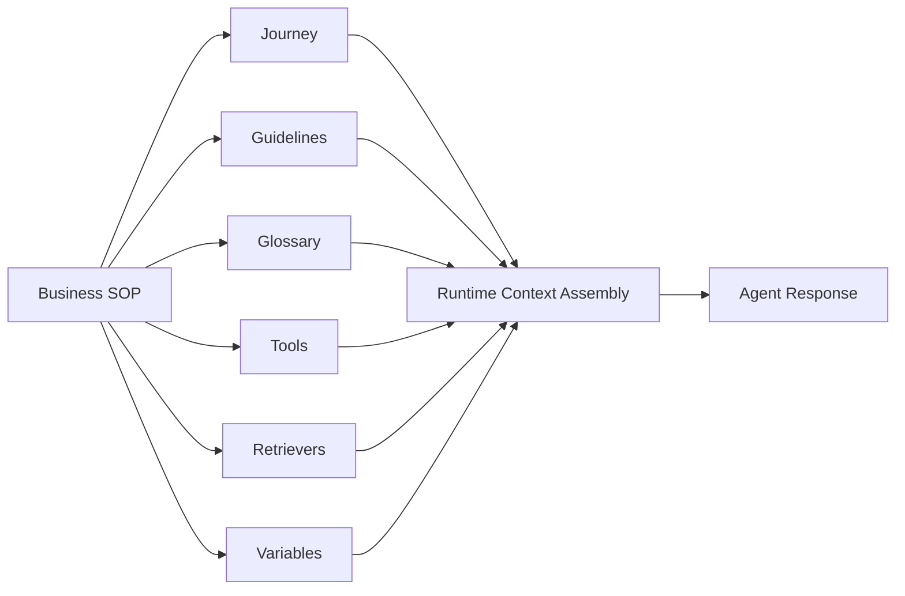
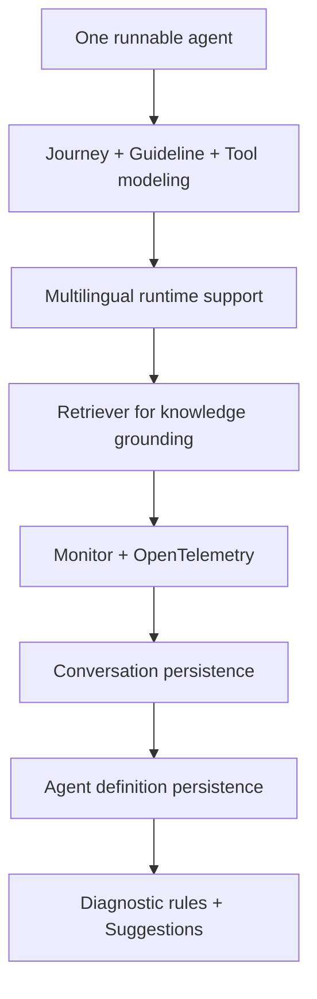

# Vibe POC Best Practice

这篇文档只总结一件事：在一个真实业务里，如何不是“做一个能聊天的 Agent demo”，而是一步步把它做成一个可构建、可测试、可监控、可迭代优化的 AgentOps POC。

这里不讨论前端页面细节，重点只放在：

- 产品构建思考
- 后端建模与运行逻辑
- 会话化 Agent 的组织方式
- 离线分析与 Suggestion
- 基于 Monitor 的调优过程

它既是一次 POC 的复盘，也是后续做正式产品时可复用的方法论。

---

## 0. 产品构建思考

### 0.1 不要把 Agent 当成“一段 Prompt”

如果一个 Agent 只是一段 prompt，那么它最多只能在单轮问答里表现不错。一旦进入真实业务，它会马上暴露出三个问题：

1. 它不知道自己当前在业务流程的什么阶段。
2. 它不知道哪些规则是必须遵守的，哪些只是补充建议。
3. 它不知道哪些知识需要临时加载，哪些动作需要调用外部系统。

所以这个 POC 的核心判断不是“Prompt 如何更长更聪明”，而是：

**Agent 必须被拆成最小可调优单元，并且在运行时动态装配。**

这也是为什么整个后端设计从一开始就围绕 Parlant 的最小建模单元展开：

- `Journey`
- `Guideline`
- `Glossary`
- `Tool`
- `Retriever`
- `Variable`
- `Canned Response`

其中：

- `Journey` 负责流程位置
- `Guideline` 负责行为与边界
- `Glossary` 负责术语一致性
- `Tool` 负责外部动作
- `Retriever` 负责知识 grounding
- `Variable` 负责状态与记忆
- `Canned Response` 负责关键表达的稳定性

这套拆法的价值，不是建模本身，而是它让 Agent 可以被系统性调优。

### 0.2 会话化 Agent，而不是静态对话机器人

这个 POC 的另一个核心思路是：Agent 必须围绕 **session** 运转，而不是围绕单条消息运转。

原因很简单。真实业务里真正有价值的不是“这句话答对了没有”，而是：

- 这段对话是针对哪个 Lead
- 当前 Lead 已经暴露了哪些信号
- 当前会话走到了哪一步
- 哪些上下文已经被记住
- 这段对话最后进入了 follow-up、handoff 还是 lead outcome

因此，会话是最小运行单元，Agent 只是围绕会话组织能力。

在这个项目里，会话里最终沉淀的不只是 transcript，还包括：

- agent / lead metadata
- language preference
- runtime variables
- self play 与 manual 的来源差异
- 会话评分
- 后续 follow-up / handoff / outcome

这是后续做 `Insights`、`Suggestion`、`CX Dashboard` 的前提。

### 0.3 离线分析不是“做报表”，而是为了优化 Agent

很多系统把对话分析做成一个 dashboard，然后停在那里。但这个 POC 的判断是：

**离线分析的目标，不是解释过去，而是优化未来。**

因此离线分析至少要回答四个问题：

1. 哪些对话是优质的，未来可以变成训练语料或测试样本？
2. 哪些对话是不达标的，问题究竟出在知识、规则、流程还是运营动作？
3. 哪些建议应该回流到 Agent 的构建层？
4. 哪些建议不属于 Agent 本身，而属于 follow-up、handoff、lead_outcome 等运营层？

这也是后来把 `Insights` 拆成四个方向的原因：

- `Conversations`
- `Suggestions`
- `Topic Explorer`
- `CX Dashboard`

### 0.4 Suggestion 不能只是“AI 感觉”

在这个 POC 里，一个非常关键的产品判断是：

**Suggestion 不能只靠模型主观复盘，而必须基于 evidence。**

因此后续形成了 `Evidence-first Reviewer` 的思路：

1. 先定义诊断规则
2. 用规则去扫 conversations、traces、queues、ratings
3. 把问题归类
4. 收集 supporting evidence
5. 打成结构化证据包
6. 再由大模型生成优化建议

这背后的原因很朴素：

- 如果没有证据，Suggestion 只是“看起来像建议”
- 如果没有 target element，Suggestion 无法落地
- 如果没有分类，Suggestion 会变成泛泛而谈

因此 Suggestion 后来被明确分成三类：

- `Knowledge Gap`
- `Guideline Gap`
- `Ops Suggestion`

### 0.5 目标客户是谁

这个产品不是为“会写 prompt 的工程师”设计的，而是为以下三类人共同工作设计的：

1. **业务运营 / Agent 管理者**
   - 拥有 SOP、业务目标、渠道策略和实际对话反馈
   - 希望低门槛构建和持续优化 Agent

2. **实施顾问 / POC Owner**
   - 需要快速证明 Agent 在真实场景中的可行性
   - 需要把 Build、Test、Monitor 串成闭环

3. **懂一点系统的开发者 / 技术运营**
   - 不希望每次都手改 prompt
   - 需要通过工具、检索、变量、运行监控做细粒度调优

所以这套 POC 的真正目标不是“做一个演示页面”，而是回答：

**一个普通业务团队，如何在不完全依赖工程师的情况下，把一个 Agent 从概念变成可运行、可验证、可优化的业务系统。**

---

## 1. 我如何一步步构建这个完整的 AgentOps POC

下面只讲后端和运行逻辑，不展开前端交互。

### 1.1 从一个 hard-coded 的保险外呼 Agent 开始

最初的起点很朴素：

- 只有一个后端 hard-coded Agent
- 场景是保险外呼资格筛选
- 目标不是卖产品，而是做 qualification、need discovery 和 handoff

第一步做的不是“做很多 Agent”，而是先把 **一个 Agent 跑通**。

这是正确顺序，因为：

- 没有一个跑通的 Agent，就没有可抽象的方法论
- 多 Agent 管理如果没有统一 definition，很快会变成混乱

### 1.2 先把 SOP 映射成 Journey + Guideline + Tool

第一轮建模的核心动作是：

1. 把业务 SOP 拆成 Journey 状态
2. 把开场、异议、长尾恢复、合规要求拆成 Guidelines
3. 把 lead profile 读取、outcome 记录、follow-up、handoff 做成 Tools
4. 用 Glossary 固定少量关键业务术语

这一步的关键不是“对象分得多细”，而是：

**先把流程、规则、知识、动作分开。**

只有分开之后，后面才能单独优化某一层，而不是每次都重写整个 Agent。

### 1.3 做多语言支持，但保持配置语言单一

后续很快出现了一个现实需求：

- 用户对话支持中 / 英 / 韩 / 德 / 日
- 但内部配置仍希望用英文维护

这一步不是做国际化页面，而是做运行时语言策略：

- session 首句语言跟随 lead profile
- 后续回复跟随最近客户输入语言
- glossary 增加多语言 alias
- preamble / opening 也要跟随语言

这一步很重要，因为它证明了一件事：

**配置语言可以是单一的，运行语言可以是多样的。**

这对真实企业部署非常关键。否则一旦所有 SOP、Guideline、Knowledge 都需要多语言分别维护，运维成本会失控。

### 1.4 加入 Retriever，把“知道什么”和“做什么”分开

接下来最关键的一步，是把 `Retriever` 独立引入，而不是继续把所有知识硬塞进 Guideline。

这里做了一个很小但很典型的例子：

- 只针对 `Medical Insurance` FAQ
- 从医疗险 wiki 中抽出 FAQ 知识块
- 用关键词检索先做最小闭环

这一步的产品价值非常高，因为它让系统第一次明确地区分：

- `Tool`：Agent 需要做什么
- `Retriever`：Agent 需要知道什么

这不是概念洁癖，而是对真实系统的影响很大：

- 如果 FAQ 解释类问题继续塞到 Tool，会让系统过度动作化
- 如果所有知识都继续塞进 Guideline，会让运行时上下文越来越脏

因此 Retriever 的加入，本质上是在为后续知识工程留接口。

### 1.5 做可观察性：Monitor 不是日志页，而是 request debugger

当 Agent 可以运行以后，第二个真正的瓶颈出现了：

**不知道它为什么这么回答。**

所以接下来不是继续扩功能，而是先做监控。

这个阶段做了几件关键事情：

1. 接入 OpenTelemetry
2. 打出核心 phase spans
3. 把 Monitor 做成 request-based debugger
4. 按 phase 拆成：
   - Guideline Match
   - Tool Calls
   - Generation
   - Analysis

这一步的意义非常大：

- Agent 不是黑盒了
- 可以看到匹配、调用、生成、分析每一步发生了什么
- 可以看到真实瓶颈在哪，而不是靠猜

这是后续所有性能优化和行为调优的前提。

### 1.6 会话持久化，构建真实的 Insights 数据底座

当 Monitor 做起来以后，下一步自然就变成：

**不能让所有对话只活在一轮调试里。**

因此后续做了：

- session 持久化
- transcript 持久化
- self play / manual 标记
- rating 持久化

会话一旦持久化，整个系统就从“试玩 Playground”变成了“有历史资产的 Agent 系统”。

这一步之后，才真正有资格开始做：

- Conversations
- Suggestions
- Topic Explorer
- CX Dashboard

### 1.7 把 Agent Definition 和 Runtime Agent 分开

这是 POC 后期一个很关键的结构性升级。

最开始：

- 一个 Agent hard-coded 在后端
- 一个 Agent 只是前端静态展示

这显然无法扩展。

因此后续做了：

1. 引入 persisted `agent definitions`
2. 让 `Build` 读取 definitions 而不是前端 hard-code
3. 支持编辑并保存 definition
4. 暂时保留 runtime agent 与 definition 的弱关联

这一步的重要性在于：

**Agent 的“定义层”和“运行层”终于被分开了。**

只有定义层独立后，未来才有可能真正做到：

- SOP -> Definition
- Definition -> Runtime registration
- Runtime feedback -> Definition iteration

### 1.8 引入 Suggestions 和 Diagnostic Rules

在有了 Conversations、Ratings、Monitor traces 之后，下一步就不是继续堆 dashboard，而是：

**让系统能提出改进建议。**

于是开始做：

- persisted `diagnostic rules`
- `Suggestions` 三分类
- 离线规则驱动 suggestion 生成

这一步虽然还没走到真正的大模型反思层，但它已经把 Suggestion 从“页面概念”推进成一个可配置系统：

- 管理者可以定义诊断规则
- 系统可以按规则生成候选建议
- Suggestion 可以回落到具体目标构件

这正是 AgentOps 的核心：不是只会看结果，而是知道下一步该改哪里。

---

## 2. 在这个 POC 中，做了哪些调优 Agent 的工作

这一部分只讲调优，不讲新功能。

### 2.1 从 Monitor 中第一次看清：问题不是“模型差”，而是链路太重

最初的直觉是：回复慢，可能是模型慢。

但真正看了 Monitor 以后才发现，慢不只是模型推理的问题，而是整个运行链路过重。

在一次 greeting 的 trace 中，能看到三段重型操作：

1. 第一次 `guideline_matcher`
2. 第二次 `guideline_matcher`
3. `message_generation`

也就是说，首句 greeting 并不是一条简单的“Hello”，而是：

- 两轮规则判断
- 一轮完整生成

这一步非常关键，因为它让调优从“靠感觉”变成了“看 trace 说话”。

### 2.2 看懂 Parlant 的 Guideline Matching 逻辑

真正有价值的观察不是“Guideline matcher 很慢”，而是：

**为什么会有这么多轮、这么重的 Guideline Matching。**

后来逐步看清楚：

1. Journey 起点里的 tool state 会触发额外的 reevaluation
2. agent-level Guideline 过多会让 opening 也变重
3. language guideline 如果铺得太宽，会在首轮引入额外判断
4. FAQ / objection / long-tail guideline 如果全都参与 opening，会让 greeting 变得非常重

这一步最大的收获不是一个具体 patch，而是理解了：

**Parlant 不是“有规则就行”，而是规则的作用域、参与时机和绑定层级会直接影响性能。**

### 2.3 去掉不必要的多轮重型 LLM 判断

在看清楚 Monitor 后，做的第一轮大优化是：

- 去掉 `load_lead_profile` 作为 Journey 起点 tool state 的结构性影响
- 让 lead context 尽量在 session metadata 中前置

原因很明确：

- 这类稳定数据不应该每轮都走 Tool，再触发 reevaluation
- 否则系统不是在“理解用户”，而是在重复加载静态信息

这一步做完后，多轮重型 preparation 明显减少。

### 2.4 收窄 Guideline 作用域

接下来做的不是删规则，而是**收窄规则作用域**：

- FAQ guideline 不再全局参与 opening
- objection guideline 不再所有阶段都参与
- long-tail guideline 只在更合适的阶段参与
- language guideline 从多条压缩成 opening 必需规则 + 后续跟随规则

这一步的启发是：

**调优 Guideline 的关键，不是数量少，而是参与每轮判断的候选集要足够干净。**

否则就算每条 Guideline 都合理，整体运行也会很重。

### 2.5 把 greeting 做成 deterministic opening fast path

最典型的一次优化，是对首句 greeting 的处理。

Monitor 清楚地说明了一件事：

- 首句开场完全不值得走完整的两轮 guideline matching + 一轮 message generation

因此后来直接把 greeting 从自动生成链路里旁路出来，做成：

- 基于 lead 语言和基本资料的 deterministic opening

这一步的收益非常直接：

- greeting 从几十秒降到毫秒级
- 同时保留了语言一致性和业务可控性

这其实也是一个产品级启发：

**不是所有回复都需要走最“聪明”的路径。**

有些高频、可预测、要求稳定的环节，更适合 deterministic 或 canned 的 fast path。

### 2.6 把“看到问题”变成“形成下一步建议”

调优走到后面，问题已经不是“能不能看见 trace”，而是：

**如何把这些观察转成管理者能执行的动作。**

因此 Suggestion 的思路逐渐明确成：

- `Knowledge Gap`
- `Guideline Gap`
- `Ops Suggestion`

这背后其实就是一次抽象：

- 如果对话答不清楚 -> 知识类建议
- 如果流程和话术不合理 -> 构建类建议
- 如果后续跟进与交接出了问题 -> 运营建议

这样 Monitor、Conversations、Ratings、Queues 才真正汇成一条线，而不是四个分散模块。

---

## 3. 这个 POC 最重要的经验，不是“做了什么”，而是“按什么顺序做”

回头看，这个 POC 最有价值的地方，不是功能数量，而是顺序。

正确顺序大致是：

如果顺序反过来，会很容易失败：

- 没有一个跑通的 runtime agent，就谈不上 Suggestions
- 没有 Monitor，就无法做真正的调优
- 没有 persisted conversations，就没有离线分析底座
- 没有 definition 层，Build 无法成为长期可维护系统

所以更准确地说，这不是“堆了一堆功能”，而是：

**一步步把一个 prompt demo，推进成一个最小可用的 AgentOps 系统。**

---

## 4. 仍未完成，但必须继续推进的事情

这部分非常重要，因为一个 POC 只有在清楚知道“什么还没做完”时，才是真正健康的。

### 4.1 如何更好地降低 Agent 构建门槛（TBD）

我们已经知道最小建模单元应该是什么，也知道最终需要 `Journey / Guideline / Retriever / Tool / Variable / Glossary / Canned Response`。

但对普通运营来说，直接操作这些概念仍然太重。

因此后续真正要解决的是：

- 如何让用户先写业务语言
- 再让系统自动拆成 Assembly
- 同时允许高级用户回到结构化层修订

这件事方向已经明确，但交互方式还没有收敛到最终解。

### 4.2 如何一键部署到多个渠道（TBD）

我们已经形成了一个比较明确的判断：

- Agent 应该通过统一 Gateway 对外暴露
- Website、TUI、WhatsApp、Feishu、DingTalk 只是不同入口

但当前这件事仍然停留在设计与占位阶段，真正的：

- 统一 gateway
- channel onboarding
- rollout
- deploy health

都还没有落成生产级能力。

### 4.3 Suggestion 的诊断规则到底是什么（TBD）

Suggestions 的框架已经清楚了，但最关键的问题仍未完全定义：

**什么样的 evidence，足以触发一个真正有价值的建议？**

也就是：

- 哪些阈值合理
- 哪些 conversation 模式足以说明 Guideline Gap
- 哪些 retriever miss 足以说明 Knowledge Gap
- 哪些 queue 结果足以说明 Ops Suggestion

这会是后续把 Suggestion 从“规则驱动的离线启发式”推进到“可信的智能优化系统”的关键。

---

## 5. 结语

这个 POC 最重要的收获，不是“证明 Parlant 能跑”，也不是“做出一个页面很多的系统”，而是逐渐厘清了一件事：

一个真实可用的 Agent 产品，必须同时具备五种能力：

1. 能构建
2. 能测试
3. 能监控
4. 能分析
5. 能迭代优化

如果缺少其中任何一环，Agent 都会停留在 demo 或 prompt playground 阶段。

iMorph 这个 POC 的价值，就在于它把这些环节第一次串成了一个闭环：

- 用最小建模单元组织 Agent
- 用 session 组织 runtime
- 用 Monitor 观察上下文装配
- 用 Conversations 和 Ratings 累积离线资产
- 用 Suggestions 把分析结果回流到 Build 和 Ops

它还远远不是最终产品，但已经足够说明一个方向：

**Agent 不是一次生成，而是一套可持续运营的系统。**

